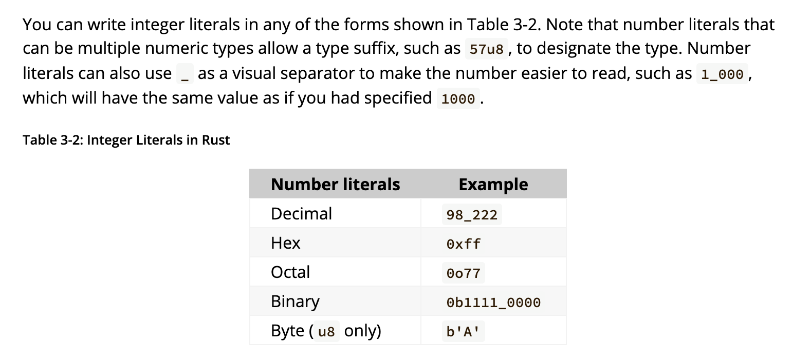

# Motivation from "The Book"
> Compiler errors can be frustrating, but really they only mean your program isn’t safely doing what you want it to do yet; they do not mean that you’re not a good programmer!

# 3.1 Variables and Immutability
## 1. Immutability
By default, variables are **immutable** in Rust. Variables can be made mutable using `mut` keyword
```Rust
let x = 7; // immutable
x = 10; // NOT ALLOWED
```

```
let mut x = 7; // mutable
x = 10; // Ok
```

But why?

If one part of our code operates on the assumption that a value will never change and another part of our code changes that value, it’s possible that the first part of the code won’t do what it was designed to do.

> NOTE: The `let` keyword can't be used in the global scope


## 2. Constants
Constants are values that are bound to a name and are not allowed to change.

```Rust
const x:i32 = 13; // Always immutable
```

- `mut` can't be used with constants. Isn't it obvious? I mean afterall they are called **_constants_** for a reason!?
- constants are declared using `const` keyword
- type value **_must_** be annotated.
- constants can be declared in any scope, including the global scope
- constants may be set only to a constant expression, **not the result** of a value that could only be computed at runtime.
- Rust’s naming convention for constants is to use all uppercase with underscores between words.

## 3. Shadowing
- A variable can be declared again with the same name and different type in Rust, this is called _shadowing_ 
- In effect, the second variable overshadows the first, taking any uses of the variable name to itself until either it itself is shadowed or the scope ends.

```Rust
fn main() {
    let x = 5;

    let x = x + 1;

    {
        let x = x * 2;
        println!("The value of x in the inner scope is: {x}");
    }

    println!("The value of x is: {x}");
}

```
- By using let, we can perform a few transformations on a value but have the variable be immutable after those transformations have been completed.

```Rust
let spaces = "   ";
let spaces = spaces.len();

```

- A variable's type can't be changed using `mut` keyword
```Rust
let mut spaces = "   ";
spaces = spaces.len(); // ERROR (E0308)
```

# 3.2 Data Types
- Rust is a statically typed language, which means that it must know the types of all variables at compile time
- The compiler can usually infer what type we want to use based on the value and how we use it.
- In case, when many types are possible, we **must** add a type annotation to the variable.

## Scalar Types
- A scalar type represents a single value. 
- Rust has four primary scalar types:
  1. integers
  2. floating-point numbers
  3. Booleans
  4. characters.

### Integers
- An integer is a number without a fractional component.
- supported signed types : i8, i16, i32, i64, i128, isize
- supported unsigned types : u8, u16, u32, u64, u128, usize
- Signed numbers are stored using two’s complement representation in Rust
- Each signed variant can store numbers from -(2^(n - 1)) to 2^(n - 1) - 1 inclusive, where n is the number of bits that variant uses.
- Unsigned variants can store numbers from 0 to 2^(n - 1)
- Additionally, the isize and usize types depend on the architecture of the computer your program is running on, which is denoted in the table as “arch”: 64 bits if you’re on a 64-bit architecture and 32 bits if you’re on a 32-bit architecture.

- Writing integers


#### Integer Overflow
In case of integer overflow,
1. If compiling in _debug_ mode, Rust will _panic_ at runtime
2. If compiling in _release_ mode, Rust performs two’s complement wrapping but the variable will have a value that probably isn’t what you were expecting it to have.

How to handle overflow?
- Wrap in all modes with the `wrapping_*` methods, such as `wrapping_add`.
- Return the `None` value if there is overflow with the `checked_*` methods.
- Return the value and a boolean indicating whether there was overflow with the `overflowing_*` methods.
- Saturate at the value’s minimum or maximum values with the `saturating_*` methods.

### Floating point
- Rust supports `f32` and `f64` for floating points
- The default type is `f64`

```Rust
fn main() {
    let x = 2.0; // f64

    let y: f32 = 3.0; // f32
}
```

### Booleans
- Booleans are one byte in size

### Character 
- Char literals are written in `single qutoes` unlike strings
- Rust’s char type is four bytes in size and represents a Unicode Scalar Value, which means it can represent a lot more than just ASCII. Accented letters; Chinese, Japanese, and Korean characters; emoji; and zero-width spaces are all valid char values in Rust.

```Rust
fn main() {
    let c = 'z';
    let z: char = 'ℤ'; // with explicit type annotation
    let heart_eyed_cat = '😻';
}
```

## Compound Types
- Compound types can group multiple values into one type.
- Rust has two primitive compound types: tuples and arrays.

### Tuples
A tuple is a general way of grouping together a number of values with a variety of types into one compound type.

- Tuples have a fixed length
- Types of the different values in the tuple don’t have to be the same
```Rust
fn main() {
    let tup: (i32, f64, u8) = (500, 6.4, 1);
}
```
- The tuple without any values has a special name, **unit**. This value and its corresponding type are both written () and represent an empty value or an empty return type.
- Expressions implicitly return the unit value if they don’t return any other value.

### Arrays
- Every element of an array must have the same type.
- Arrays have fixed size
- Values are written in square brackets `[]`
```Rust
fn main() {
    let a = [1, 2, 3, 4, 5];
}
```
- Arrays are useful when you want your data allocated on the stack rather than the heap 
- You write an array’s type using square brackets with the type of each element, a semicolon, and then the number of elements in the array, like so:
```Rust
let a: [i32; 5] = [1, 2, 3, 4, 5];
```
here, `i32` is the type of each element, and `5` is the size of the array.

- You can also initialize an array to contain the same value for each element by specifying the initial value, followed by a semicolon, and then the length of the array in square brackets, as shown here
```Rust
let a = [3; 5];
```
that creates the array a = [3,3,3,3,3];

#### Accessing Array elements
```Rust
let a = [1,4,5,6011,4];
let first = a[0];
let second = a[1];
```

# 3.3 Functions
- Rust code uses snake case as the conventional style for function and variable names, in which all letters are lowercase and underscores separate words.
- Rust doesn’t care where you define your functions, only that they’re defined somewhere in a scope that can be seen by the caller.

## Statements and Expressions
- **Statements** are instructions that perform some action and do not return a value.
- **Expressions** evaluate to a resultant value. Let’s look at some examples.

Statements:
- Creating a variable and assigning a value to it with the let keyword is a statement. In Listing 3-1, let y = 6; is a statement.
```Rust
fn main() {
  let y = 6; // Statement
}
```

- Statements do not return values. Therefore, you can’t assign a let statement to another variable
```Rust
fn main() {
    let x = (let y = 6); // Error
}
```

Expressions:
- Calling a function is an expression.
- Calling a macro is an expression. 
- A new scope block created with curly brackets is an expression
```Rust
fn main() {
    let y = {   // Expression
        let x = 3;
        x + 1   // NOTE : No semicolon is used here, becuase expressions don't end in semi colon
    };

    println!("The value of y is: {y}");
}
```
- **Expressions do not include ending semicolons**

## Functions with Return Values
- We must declare their type after an arrow (->)
```Rust
fn five() -> i32 {
    5
}
```

```Rust
fn main() {
    let x = plus_one(5);

    println!("The value of x is: {x}");
}

fn plus_one(x: i32) -> i32 {
    x + 1
}
```

# 3.4 Control Flow

## `If`
- Blocks of code associated with the conditions in if expressions are sometimes called _arms_

## `If` in a `let` statement
```Rust
fn main() {
    let condition = true;
    let number = if condition { 5 } else { 6 };

    println!("The value of number is: {number}");
}
```

## Loops

### `loop` keyword
The loop keyword tells Rust to execute a block of code over and over again forever or until you explicitly tell it to stop.

### Returning values from loops
```Rust
fn main() {
    let mut counter = 0;

    let result = loop {
        counter += 1;

        if counter == 10 {
            break counter * 2;
        }
    };

    println!("The result is {result}");
}
```

### Loop labels to disambiguate between multiple loops
If you have loops within loops, break and continue apply to the innermost loop at that point. You can optionally specify a loop label on a loop that you can then use with break or continue to specify that those keywords apply to the labeled loop instead of the innermost loop.

```Rust
fn main() {
    let mut count = 0;
    'counting_up: loop {
        println!("count = {count}");
        let mut remaining = 10;

        loop {
            println!("remaining = {remaining}");
            if remaining == 9 {
                break;
            }
            if count == 2 {
                break 'counting_up;
            }
            remaining -= 1;
        }

        count += 1;
    }
    println!("End count = {count}");
}
```

### While loops
```Rust
fn main() {
    let mut number = 3;

    while number != 0 {
        println!("{number}!");

        number -= 1;
    }

    println!("LIFTOFF!!!");
}
```

### `for`-`in` loop
```Rust
fn main() {
    let a = [10, 20, 30, 40, 50];

    for element in a {
        println!("the value is: {element}");
    }
}
```